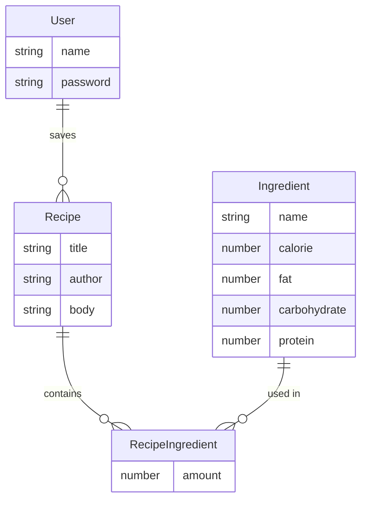

# Cookbook

CRUD-application for managing and sharing recipes.

## Built with

- Node
- Express
- MongoDB (Mongoose)
- EJS

___

## ER diagram

- **All** nutritional values are per 100 g. Amounts are in **grams**.

___
